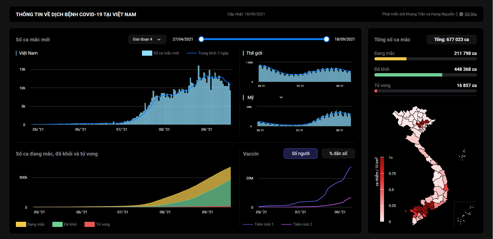

# Vietnam Covid Dashboard

A data view of the Covid-19 pandemic in Vietnam

# Contributors
- [Hưng Nguyễn](https://hulk1999.github.io/Portfolio)
- [Khang Trần]()

# Data Coverage & Sources:
1. Daily New Cases: https://www.worldometers.info/coronavirus/
  - Vietnam
  - World and Some Countries
2. Total Cases, Recoveries & Deaths: https://www.worldometers.info/coronavirus/
3. Total Vaccinations: https://ourworldindata.org/covid-vaccinations?country=VNM
4. Total Cases & Deaths in Provinces: https://ncov.vncdc.gov.vn/viet-nam.html